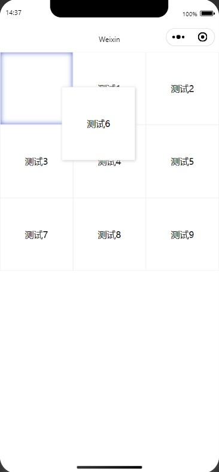
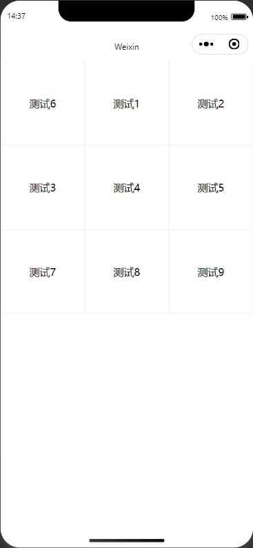

# drag-grid-for-weapp
### 微信小程序端拖动宫格组件

## 传参
1. list(用于渲染宫格的数组)
2. draggable(描述是否可拖动)
3. columnnum(描述一行展示几条)
4. bind:listChange(当拖动组件结束后改变原始数组的函数,参数中带有排序后的数组)

 ## 使用
 ```json
 //json部分
 {
  "usingComponents": {
    "drag-grid": "../components/DragGrid/DragGrid"
  }
}
 ```
 ```javascript
 //js部分
  data(){
    myList: [
      {name:"测试1"},
      {name:"测试2"},
      {name:"测试3"},
      {name:"测试4"},
      {name:"测试5"},
      {name:"测试6"},
      {name:"测试7"},
      {name:"测试8"},
      {name:"测试9"},
    ] 
  },
  updateList(result) {
     this.setData({
       myList:result.detail
     })
   }
 ```
 ```html
 <!-- wxml部分 -->
  <drag-grid
    list="{{myList}}"
    draggable="{{true}}"
    columnnum="{{3}}"
    bind:listChange="updateList"
  />
 ```

 ## 效果
 
 
 

